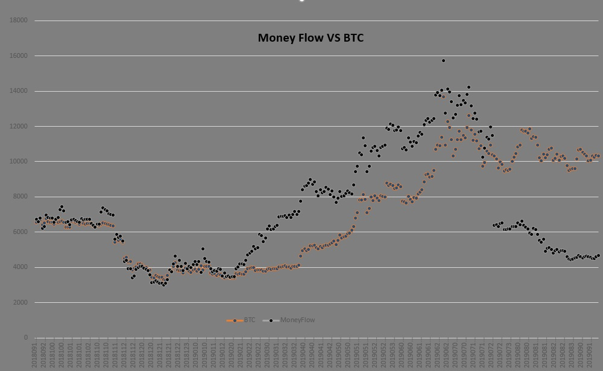

# Research results

This is the data from the coinmarketcap for the first 150 coins per year. Data was taken once a day at approximately the same time. This is the main part of my research, which formed the basis of the trading strategy. These data allow us better understand the market and coins in particular.